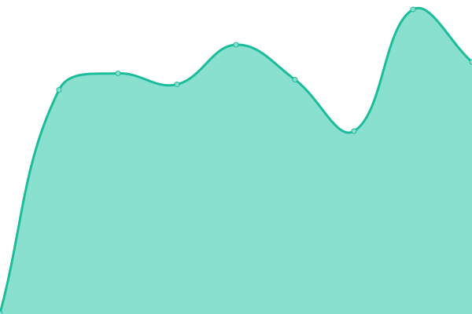
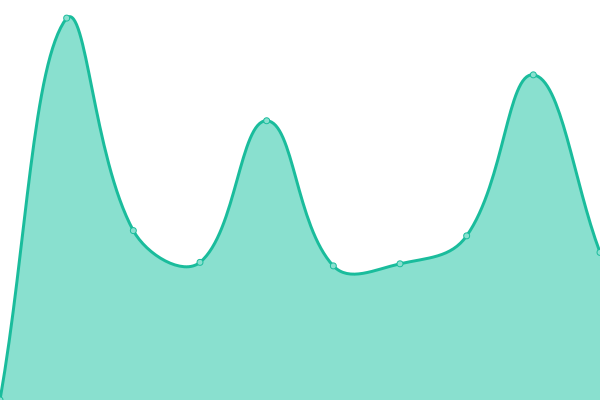
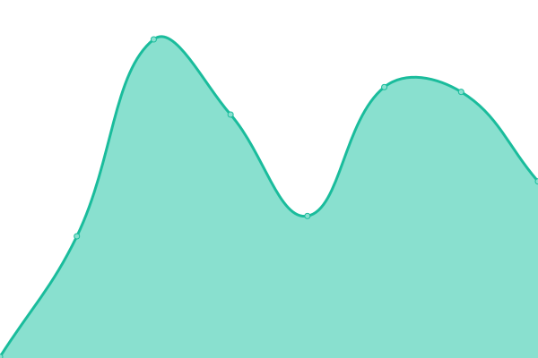
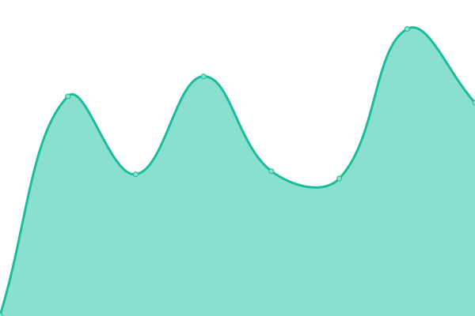
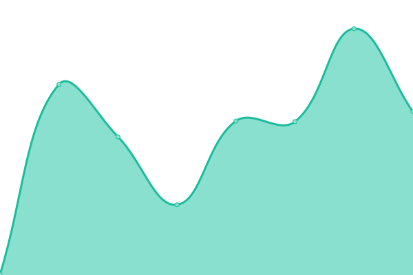
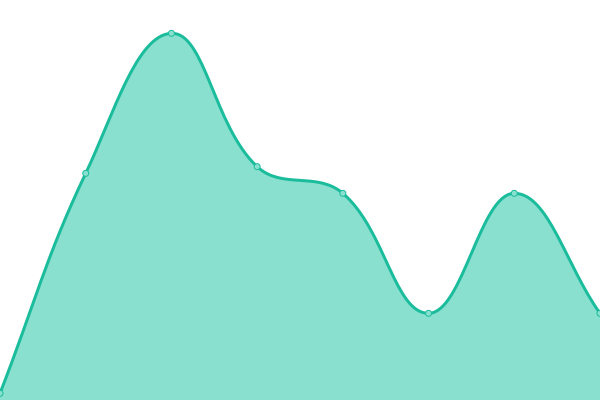
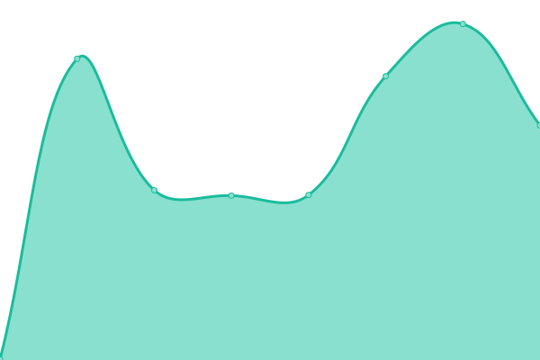
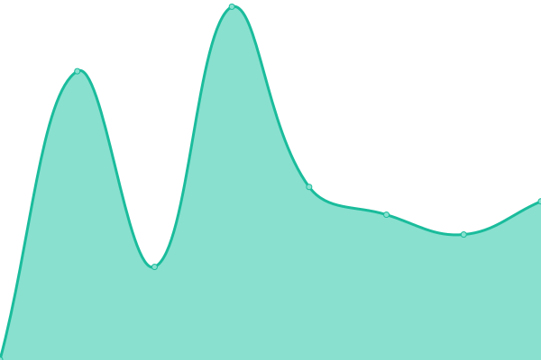
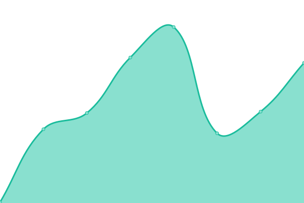

# [📈 Live Status](https://rewin23.github.io/gofeels-uptime): <!--live status--> **🟧 Partial outage**

This repository contains the open-source uptime monitor and status page for [Erwin Navarrete](https://rewin23.github.io/gofeels-uptime), powered by [Upptime](https://github.com/upptime/upptime).

With [Upptime](https://upptime.js.org), you can get your own unlimited and free uptime monitor and status page, powered entirely by a GitHub repository. We use [Issues](https://github.com/rewin23/gofeels-uptime/issues) as incident reports, [Actions](https://github.com/rewin23/gofeels-uptime/actions) as uptime monitors, and [Pages](https://rewin23.github.io/gofeels-uptime) for the status page.

<!--start: status pages-->
<!-- This summary is generated by Upptime (https://github.com/upptime/upptime) -->
<!-- Do not edit this manually, your changes will be overwritten -->
<!-- prettier-ignore -->
| URL | Status | History | Response Time | Uptime |
| --- | ------ | ------- | ------------- | ------ |
|  [GoFeels API](https://api.gofeels.com) | 🟩 Up | [go-feels-api.yml](https://github.com/rewin23/gofeels-uptime/commits/HEAD/history/go-feels-api.yml) | 

 736ms
     
 | 

<a href="https://rewin23.github.io/gofeels-uptime/history/go-feels-api">100.00%</a>
    

|  [GoFeels website](https://www.gofeels.com) | 🟩 Up | [go-feels-website.yml](https://github.com/rewin23/gofeels-uptime/commits/HEAD/history/go-feels-website.yml) | 

 6813ms
     
 | 

<a href="https://rewin23.github.io/gofeels-uptime/history/go-feels-website">100.00%</a>
    

|  [GoFeels PMS](https://app.gofeels.com) | 🟩 Up | [go-feels-pms.yml](https://github.com/rewin23/gofeels-uptime/commits/HEAD/history/go-feels-pms.yml) | 

 219ms
     
 | 

<a href="https://rewin23.github.io/gofeels-uptime/history/go-feels-pms">100.00%</a>
    

|  [GoFeels Dashboard](https://admin.gofeels.com) | 🟥 Down | [go-feels-dashboard.yml](https://github.com/rewin23/gofeels-uptime/commits/HEAD/history/go-feels-dashboard.yml) | 

 0ms
     
 | 

<a href="https://rewin23.github.io/gofeels-uptime/history/go-feels-dashboard">0.00%</a>
    

|  [GoFeels Motor de reserva](https://reserva.gofeels.com) | 🟥 Down | [go-feels-motor-de-reserva.yml](https://github.com/rewin23/gofeels-uptime/commits/HEAD/history/go-feels-motor-de-reserva.yml) | 

 895ms
     
 | 

<a href="https://rewin23.github.io/gofeels-uptime/history/go-feels-motor-de-reserva">0.00%</a>
    

|  [GoFeels Booking service](https://reserva.gofeels.com) | 🟥 Down | [go-feels-booking-service.yml](https://github.com/rewin23/gofeels-uptime/commits/HEAD/history/go-feels-booking-service.yml) | 

 36ms
     
 | 

<a href="https://rewin23.github.io/gofeels-uptime/history/go-feels-booking-service">0.00%</a>
    

|  [GoFeels Roombeast service](https://roombeast.gofeels.com) | 🟩 Up | [go-feels-roombeast-service.yml](https://github.com/rewin23/gofeels-uptime/commits/HEAD/history/go-feels-roombeast-service.yml) | 

 372ms
     
 | 

<a href="https://rewin23.github.io/gofeels-uptime/history/go-feels-roombeast-service">100.00%</a>
    

|  [GoFeels gitlab](https://gitlab.gofeels.com) | 🟩 Up | [go-feels-gitlab.yml](https://github.com/rewin23/gofeels-uptime/commits/HEAD/history/go-feels-gitlab.yml) | 

 557ms
     
 | 

<a href="https://rewin23.github.io/gofeels-uptime/history/go-feels-gitlab">100.00%</a>
    

|  [GoFeels gitlab registry](https://registry.gitlab.gofeels.com) | 🟩 Up | [go-feels-gitlab-registry.yml](https://github.com/rewin23/gofeels-uptime/commits/HEAD/history/go-feels-gitlab-registry.yml) | 

 197ms
     
 | 

<a href="https://rewin23.github.io/gofeels-uptime/history/go-feels-gitlab-registry">100.00%</a>
    

<!--end: status pages-->

[**Visit our status website →**](https://rewin23.github.io/gofeels-uptime)

## 📄 License

- Powered by: [Upptime](https://github.com/upptime/upptime)
- Code: [MIT](./LICENSE) © [Erwin Navarrete](https://rewin23.github.io/gofeels-uptime)
- Data in the `./history` directory: [Open Database License](https://opendatacommons.org/licenses/odbl/1-0/)
